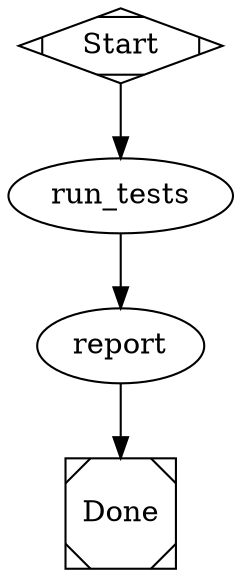
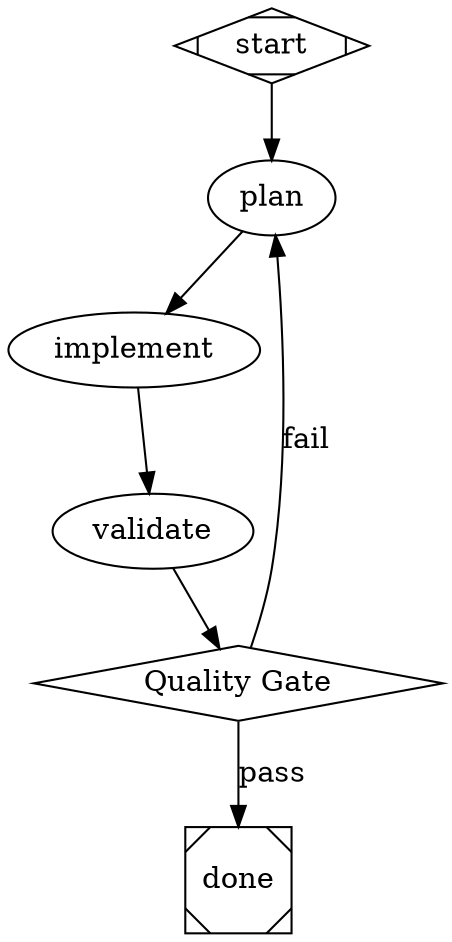
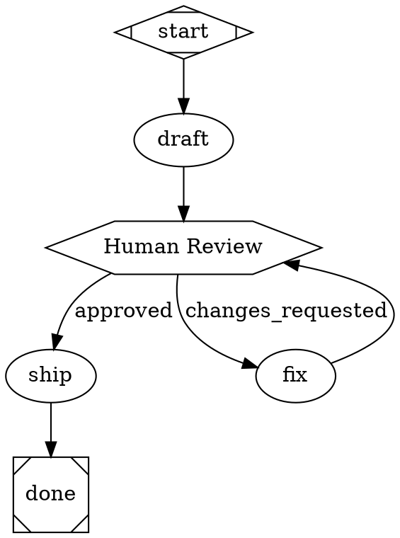
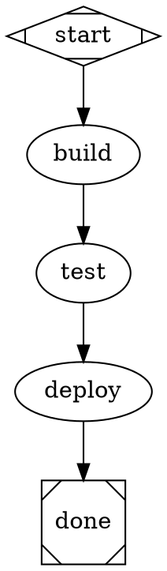
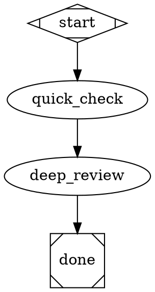

# Attractor

A DOT-based pipeline runner for orchestrating multi-stage AI workflows. Define your workflow as a directed graph using Graphviz DOT syntax — nodes are tasks, edges are transitions — and Attractor executes it with LLM integration, human gates, parallel execution, and checkpoint/resume.

Built from the [strongdm/attractor](https://github.com/strongdm/attractor) NLSpecs.

## Quick Start

```bash
# Install dependencies
pnpm install

# Build all packages
pnpm build

# Validate a pipeline
node packages/cli/dist/index.js validate examples/simple.dot

# Run a pipeline (echo mode — no API keys needed)
node packages/cli/dist/index.js run examples/simple.dot --auto-approve

# Run with an LLM backend
export ANTHROPIC_API_KEY=sk-ant-...
node packages/cli/dist/index.js run examples/branching.dot
```

## Writing Pipelines

Pipelines are `.dot` files using a subset of Graphviz DOT syntax. Every pipeline needs exactly one start node (`Mdiamond`) and one exit node (`Msquare`).

### Minimal Example



### Node Types

Nodes are mapped to handlers via their `shape` attribute:

| Shape | Handler | Description |
|---|---|---|
| `Mdiamond` | **start** | Pipeline entry point (no-op) |
| `Msquare` | **exit** | Pipeline exit point (no-op) |
| `box` (default) | **codergen** | LLM task — sends `prompt` to an LLM backend |
| `hexagon` | **wait.human** | Pauses for human input, routes based on selection |
| `diamond` | **conditional** | Routes based on edge conditions |
| `component` | **parallel** | Fans out to multiple branches concurrently |
| `tripleoctagon` | **parallel.fan_in** | Waits for parallel branches, picks best result |
| `parallelogram` | **tool** | Executes a shell command (`tool_command` attr) |
| `house` | **stack.manager_loop** | Supervisor loop over a child pipeline |

### Node Attributes

```dot
my_node [
  shape=box,
  label="Descriptive Name",
  prompt="Instructions for the LLM. Use $goal for the pipeline goal.",
  max_retries=3,
  goal_gate=true,
  timeout="900s",
  llm_model="claude-sonnet-4-20250514",
  reasoning_effort="high"
]
```

| Attribute | Type | Default | Description |
|---|---|---|---|
| `prompt` | String | `""` | Instructions sent to the LLM. `$goal` is expanded. |
| `max_retries` | Integer | inherited | Additional attempts beyond the initial execution |
| `goal_gate` | Boolean | `false` | Must succeed before pipeline can exit |
| `retry_target` | String | `""` | Node to jump to if retries are exhausted |
| `timeout` | Duration | unset | Max execution time (`900s`, `15m`, `2h`) |
| `llm_model` | String | inherited | LLM model identifier |
| `reasoning_effort` | String | `"high"` | `low`, `medium`, or `high` |
| `fidelity` | String | inherited | Context mode: `full`, `compact`, `truncate`, `summary:low/medium/high` |

### Edge Attributes

```dot
gate -> exit      [label="pass", condition="outcome=success", weight=2]
gate -> implement [label="fail", condition="outcome!=success"]
```

| Attribute | Type | Default | Description |
|---|---|---|---|
| `label` | String | `""` | Display label and routing key |
| `condition` | String | `""` | Boolean guard (see Condition Language below) |
| `weight` | Integer | `0` | Priority for tiebreaking (higher wins) |
| `fidelity` | String | unset | Override fidelity for the target node |
| `loop_restart` | Boolean | `false` | Restart the pipeline with a fresh log directory |

### Condition Language

Edge conditions use a simple expression language:

```
outcome=success                          # last node succeeded
outcome!=success                         # last node did not succeed
context.tests_passed=true                # check a context variable
outcome=success && context.ready=true    # AND conjunction
```

Operators: `=` (equals), `!=` (not equals), `&&` (AND). Variables: `outcome`, `preferred_label`, `context.*`.

### Chained Edges

```dot
start -> plan -> implement -> validate -> exit
```

This expands to individual edges: `start->plan`, `plan->implement`, etc.

## Pipeline Patterns

### Conditional Branching



### Human-in-the-Loop



### Goal Gates with Retry



### Model Stylesheet

Centralize LLM configuration with CSS-like rules:



Selectors by specificity: `*` (universal) < `box` (shape) < `.class` < `#id`.

## CLI Reference

```
attractor <command> [options]

Commands:
  run <file.dot>        Run a pipeline
  validate <file.dot>   Validate without running
  serve                 Start HTTP server (coming soon)

Run options:
  --logs-dir <dir>      Log directory (default: ./attractor-logs/<timestamp>)
  --auto-approve        Auto-approve human gates
  --model <model>       LLM model override
  --provider <name>     LLM provider (anthropic, openai, gemini)
```

## Using as a Library

### Run a Pipeline Programmatically

```typescript
import { parseDot, buildGraph, validate, run, createDefaultRegistry } from '@attractor/engine';
import type { CodergenBackend } from '@attractor/engine';

// Parse and validate
const ast = parseDot(dotSource);
const graph = buildGraph(ast);
const diagnostics = validate(graph);

// Set up a backend
const backend: CodergenBackend = {
  async run(node, prompt, context) {
    // Call your LLM, return the response text or an Outcome
    return 'LLM response here';
  },
};

// Run
const outcome = await run(graph, {
  logsRoot: './logs',
  handlerRegistry: createDefaultRegistry(backend),
  onEvent(event) {
    console.log(event.type, event);
  },
});

console.log('Pipeline result:', outcome.status);
```

### Use the Unified LLM Client

```typescript
import { Client, OpenAIAdapter, AnthropicAdapter, generate } from '@attractor/llm';

// Environment-based (reads API keys from env vars)
const client = Client.fromEnv();

// Or explicit
const client = new Client({
  providers: {
    anthropic: new AnthropicAdapter({ apiKey: 'sk-ant-...' }),
    openai: new OpenAIAdapter({ apiKey: 'sk-...' }),
  },
  defaultProvider: 'anthropic',
});

// Simple generation
const response = await client.complete({
  model: 'claude-sonnet-4-20250514',
  messages: [{ role: 'user', content: 'Hello!' }],
});

// High-level API with tool loop
const response = await generate({
  model: 'claude-sonnet-4-20250514',
  messages: 'Fix the bug in auth.ts',
  tools: [readFileTool, editFileTool],
  executeToolCall: async (tc) => { /* handle tool call */ },
  client,
});
```

### Use the Coding Agent Loop

```typescript
import { Session, createAnthropicProfile, LocalExecutionEnvironment } from '@attractor/agent';
import { Client } from '@attractor/llm';

const session = new Session({
  client: Client.fromEnv(),
  profile: createAnthropicProfile({ model: 'claude-sonnet-4-20250514' }),
  executionEnv: new LocalExecutionEnvironment('/path/to/project'),
  config: { maxToolRoundsPerInput: 20 },
});

session.eventEmitter.on((event) => {
  if (event.kind === 'assistant.text.delta') {
    process.stdout.write(event.data.text as string);
  }
});

await session.submit('Fix the failing tests in src/auth.ts');

// Steer mid-task
session.steer('Focus on the login function, not registration');

await session.close();
```

## Architecture

```
@attractor/cli          CLI entry point
       |
@attractor/engine       Pipeline engine (DOT parser, execution, handlers)
       |
@attractor/agent        Coding agent loop (session, tools, profiles)
       |
@attractor/llm          Unified LLM client (OpenAI, Anthropic, Gemini)
```

## Run Directory Structure

Each pipeline run produces artifacts:

```
attractor-logs/<timestamp>/
  manifest.json                 # Pipeline metadata
  checkpoint.json               # Resume point
  <node_id>/
    prompt.md                   # Rendered prompt sent to LLM
    response.md                 # LLM response
    status.json                 # Execution outcome
  artifacts/
    <artifact_id>.json          # Large stage outputs
```

## Environment Variables

| Variable | Provider |
|---|---|
| `ANTHROPIC_API_KEY` | Anthropic (Claude) |
| `OPENAI_API_KEY` | OpenAI (GPT) |
| `GEMINI_API_KEY` or `GOOGLE_API_KEY` | Google (Gemini) |

Optional: `*_BASE_URL` for custom endpoints, `OPENAI_ORG_ID`, `OPENAI_PROJECT_ID`.

## Requirements

- Node.js >= 20
- pnpm >= 9

## License

Apache-2.0
