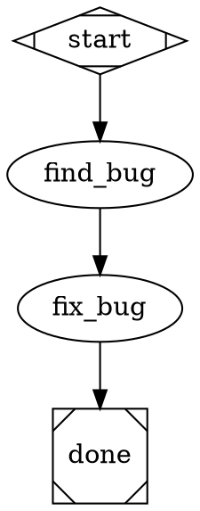
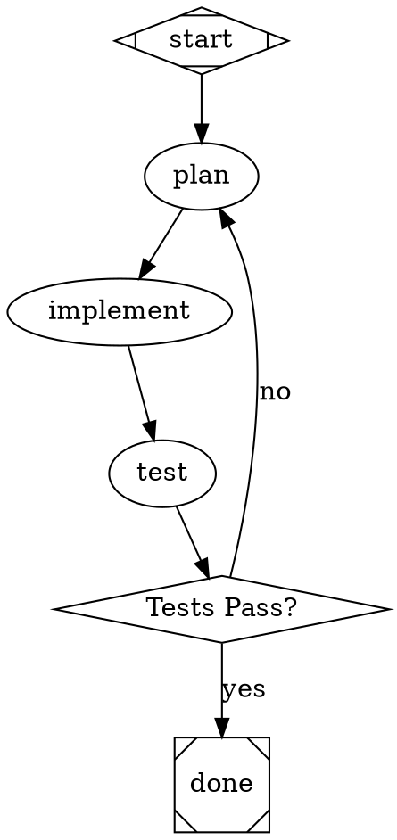
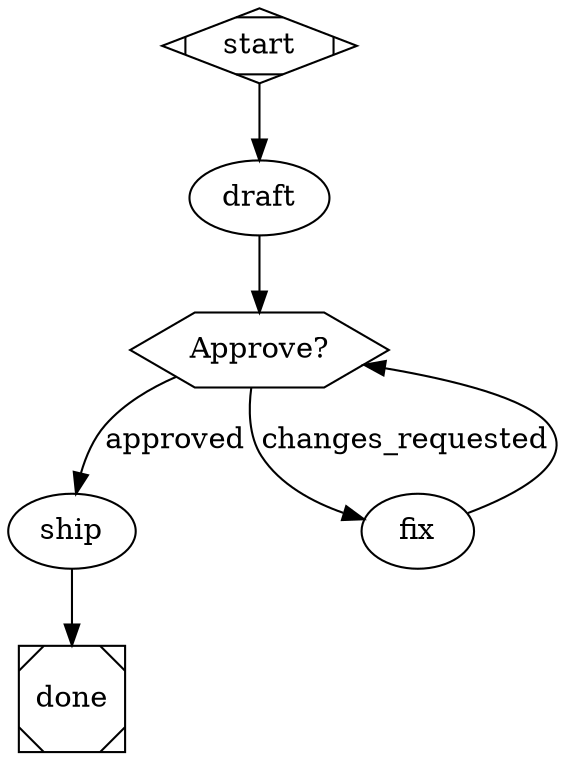
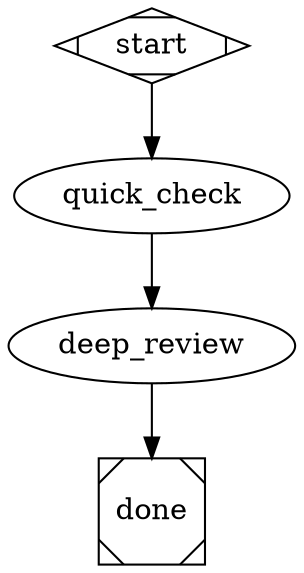
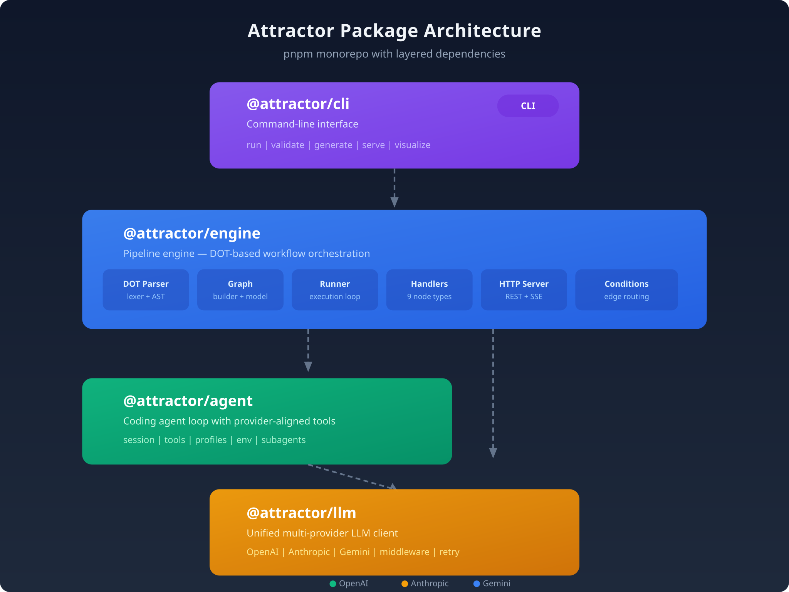
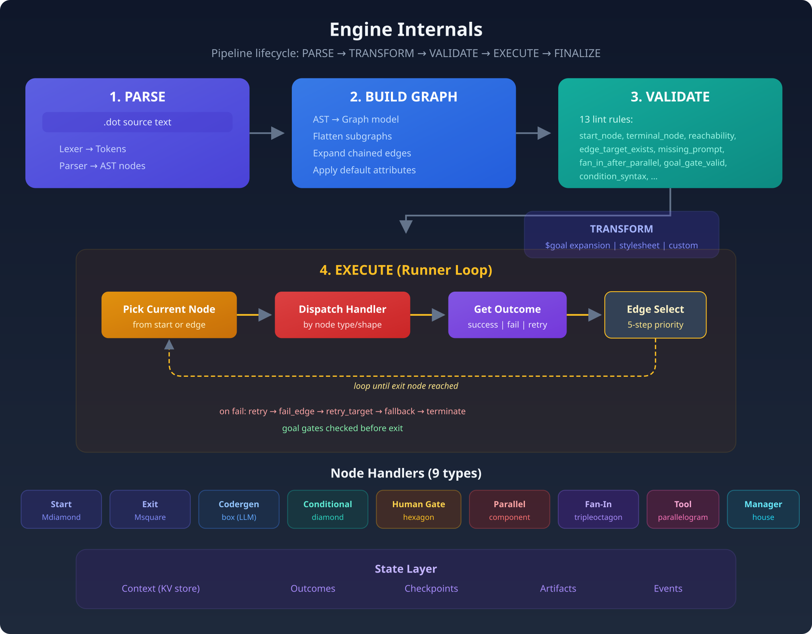
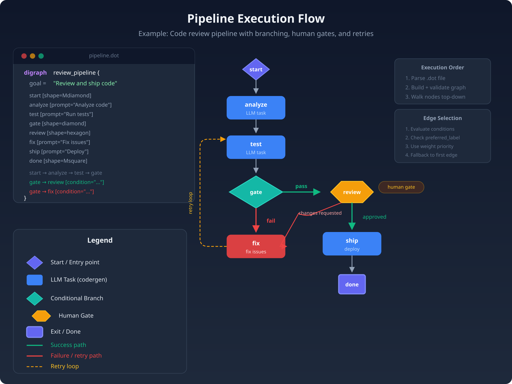
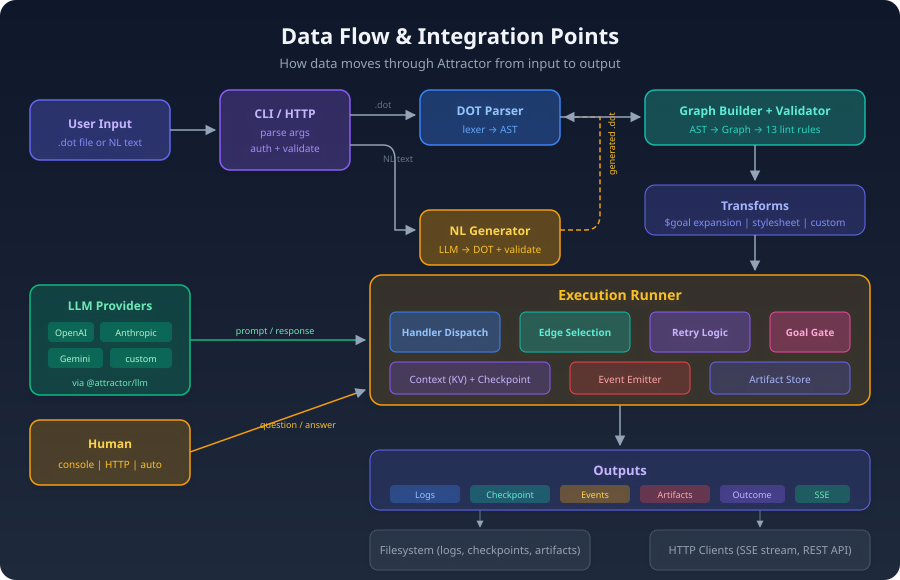

# Attractor

Attractor lets you **build AI workflows as simple flowcharts**. You describe what you want done — step by step — in a text file, and Attractor runs each step using AI, routing between them automatically.

Think of it as a recipe book for AI agents. Write the recipe once, run it as many times as you want.

Built from the [strongdm/attractor](https://github.com/strongdm/attractor) NLSpecs.

## How It Works

### 1. Write a flowchart (a `.dot` file)



That's it. You're saying: _"Start, find the bug, fix it, done."_ The `prompt` is what the AI gets told to do at each step.

### 2. Run it

```bash
attractor run fix_bug.dot
```

### 3. Attractor does the work

It reads your flowchart, calls an AI (Claude, GPT, or Gemini) at each step, saves the results, and moves on to the next step until it reaches the end.

## Getting Started

```bash
# Clone and install
git clone https://github.com/bphansg/attractor.git
cd attractor
pnpm install
pnpm build

# Try it out (no API keys needed — runs in echo mode)
node packages/cli/dist/index.js run examples/simple.dot --auto-approve

# With a real AI backend
export ANTHROPIC_API_KEY=sk-ant-...   # or OPENAI_API_KEY or GEMINI_API_KEY
node packages/cli/dist/index.js run examples/simple.dot
```

## Try This in 5 Minutes (No API Key Required)

Want to see Attractor in action without setting up any API keys? Here's how:

```bash
# 1. Clone and build (one time setup)
git clone https://github.com/bphansg/attractor.git
cd attractor
pnpm install && pnpm build

# 2. Run a pipeline with human approval gates in echo mode
node packages/cli/dist/index.js run examples/secure-pr-review.dot --auto-approve

# 3. Watch it execute a complete workflow:
#    plan → implement → test → security review gate → merge
```

**Echo mode** simulates AI responses without calling any real APIs. The `--auto-approve` flag automatically approves human gates (hexagon nodes), so you can see the entire workflow run end-to-end instantly.

Try these other examples too:
- `examples/simple.dot` — Basic linear workflow
- `examples/review.dot` — Human approval gates with feedback loops  
- `examples/branching.dot` — Conditional branching based on test outcomes

## Generate Pipelines from Plain English

Don't want to write DOT by hand? Just describe what you want in natural language and Attractor will generate the pipeline for you:

```bash
# Describe your workflow in plain English
attractor generate "Run the test suite, and if anything fails, fix the code and re-run until everything passes"

# Save the generated pipeline to a file
attractor generate "Draft a blog post, get human approval, then publish" --output blog.dot

# Then run it
attractor run blog.dot
```

Attractor sends your description to an AI, generates a valid `.dot` file, and even validates it automatically — retrying once if the first attempt has errors.

You can also use this programmatically:

```typescript
import { generateDot } from '@attractor/engine';

const result = await generateDot({
  description: 'Build the project, run tests, deploy to staging',
});

console.log(result.dot);          // The generated DOT pipeline
console.log(result.diagnostics);  // Any validation warnings
```

## What Can You Put in a Pipeline?

### AI Tasks (the default)

Any node without a special shape is an AI task. Give it a `prompt` and Attractor sends it to your LLM:

```dot
plan     [prompt="Create a plan for $goal"]
implement[prompt="Write the code according to the plan"]
test     [prompt="Run the tests and report results"]
```

The `$goal` variable is replaced with the pipeline's `goal` attribute — so you set the goal once and every step can reference it.

### Branching ("if this, then that")

Use a diamond-shaped node to branch based on what happened:



If tests pass, the pipeline finishes. If they fail, it loops back to plan and tries again.

### Human Checkpoints ("ask me first")

Use a hexagon node to pause and ask a human before continuing:



When the pipeline hits `review_gate`, it shows you the options in your terminal. You pick one, and it routes accordingly. Use `--auto-approve` to skip these gates in CI/automation.

#### Why Human Gates Matter

Human approval gates follow a key principle from [Google's Beyond Zero security model](https://arxiv.org/html/2605.22985): critical decisions should require human verification, even in automated systems. Rather than granting agents unrestricted access, you place explicit checkpoints where humans review and authorize high-risk actions before they execute.

This is especially important for AI agents that can modify code, access production systems, or make irreversible changes. A hexagon gate lets you inspect the agent's plan, check for security issues, and approve or reject before the workflow continues. See Google's [Beyond Zero blog post](https://blog.google/security/going-beyond-zero-a-new-paradigm-for-enterprise-security/) for more on this approach.

_Note: Attractor is a workflow tool and does not claim to implement the full Beyond Zero framework._

### Automatic Retries

If a step fails, Attractor can retry it automatically:

```dot
deploy [prompt="Deploy to staging", max_retries=3]
```

`max_retries=3` means up to 4 total attempts (1 initial + 3 retries). You can also set a default for all nodes:

```dot
graph [default_max_retries=2]
```

### Goal Gates ("don't finish until this succeeds")

Mark critical steps that _must_ succeed before the pipeline can exit:

```dot
build [prompt="Build the project", goal_gate=true, retry_target="build"]
test  [prompt="Run the test suite", goal_gate=true, retry_target="test"]
```

If the pipeline reaches the exit and a goal gate hasn't succeeded, it jumps to the `retry_target` instead of finishing.

### Using Different AI Models

You can pick which model runs each step. A fast/cheap model for simple tasks, a powerful one for hard tasks:



This works like CSS: `*` applies to all nodes, `.fast` applies to nodes with `class="fast"`, and `#deep_review` targets a specific node by ID.

## All Node Types at a Glance

| Shape | What It Does | When to Use It |
|---|---|---|
| `Mdiamond` | Entry point | Every pipeline needs exactly one |
| `Msquare` | Exit point | Every pipeline needs exactly one |
| `box` (default) | Sends a prompt to an AI | Most of your steps |
| `hexagon` | Asks a human to decide | Approval gates, code review |
| `diamond` | Routes based on conditions | "If tests pass, continue; otherwise retry" |
| `component` | Runs multiple steps in parallel | Speed up independent tasks |
| `tripleoctagon` | Waits for parallel steps, picks best | After a parallel fan-out |
| `parallelogram` | Runs a shell command | Non-AI tasks like `npm test` |
| `house` | Supervises a child pipeline | Complex nested workflows |

## Conditions Cheat Sheet

Conditions on edges decide which path to take:

```
outcome=success                  # Previous step succeeded
outcome!=success                 # Previous step failed
outcome=fail                     # Explicit failure
preferred_label=approved         # Human picked "approved"
context.tests_passed=true        # Custom variable from context
outcome=success && context.x=1   # AND — both must be true
```

## CLI Reference

```bash
# Validate a pipeline (check for errors without running)
attractor validate pipeline.dot

# Run a pipeline
attractor run pipeline.dot

# Run without human prompts (auto-approve all gates)
attractor run pipeline.dot --auto-approve

# Specify where to save logs
attractor run pipeline.dot --logs-dir ./my-logs

# Use a specific model/provider
attractor run pipeline.dot --model claude-sonnet-4-20250514 --provider anthropic

# Generate a pipeline from a natural language description
attractor generate "Run tests, fix any failures, then generate a report"

# Generate and save to a file
attractor generate "Build the project, run tests, get human approval, then deploy" --output deploy.dot
```

## REST API / HTTP Server

Run Attractor as an HTTP server to trigger and monitor pipelines from any client:

```bash
# Start the server
attractor serve --port 3000
```

### Endpoints

| Method | Endpoint | Description |
|--------|----------|-------------|
| `POST` | `/api/v1/pipelines/run` | Start a pipeline from DOT source |
| `POST` | `/api/v1/pipelines/validate` | Validate DOT without running |
| `POST` | `/api/v1/pipelines/generate` | Generate DOT from natural language |
| `GET` | `/api/v1/pipelines/:id` | Get pipeline run status |
| `GET` | `/api/v1/pipelines/:id/events` | SSE stream of live events |
| `POST` | `/api/v1/pipelines/:id/answer` | Respond to a human gate question |
| `DELETE` | `/api/v1/pipelines/:id` | Abort a running pipeline |
| `GET` | `/api/v1/health` | Health check |

### Example: Run a pipeline via API

```bash
# Start a pipeline
curl -X POST http://localhost:3000/api/v1/pipelines/run \
  -H "Content-Type: application/json" \
  -d '{"dot": "digraph { goal=\"Test\" start [shape=Mdiamond] greet [prompt=\"Say hi\"] done [shape=Msquare] start -> greet -> done }", "autoApprove": true}'

# Check status
curl http://localhost:3000/api/v1/pipelines/<id>

# Stream live events (SSE)
curl http://localhost:3000/api/v1/pipelines/<id>/events
```

### Human Gates over HTTP

When a pipeline hits a human approval gate, it pauses and emits a `question` event via SSE. Answer it with:

```bash
curl -X POST http://localhost:3000/api/v1/pipelines/<id>/answer \
  -H "Content-Type: application/json" \
  -d '{"value": "approved", "text": "Looks good"}'
```

This lets you build web UIs, Slack bots, or CI integrations that interact with human gates.

You can also use the server programmatically:

```typescript
import { createServer } from '@attractor/engine';

const server = createServer({ port: 3000 });
await server.start();
```

## What Happens When You Run a Pipeline

Attractor creates a log directory for each run with everything that happened:

```
attractor-logs/2026-03-21T22-32-00/
  manifest.json              # Pipeline metadata (name, goal, start time)
  checkpoint.json            # Where execution left off (for resume)
  find_bug/
    prompt.md                # What was sent to the AI
    response.md              # What the AI responded
    status.json              # success, fail, retry, etc.
  fix_bug/
    prompt.md
    response.md
    status.json
```

This means you always have a record of what the AI did, what it was asked, and whether each step succeeded.

## Using Attractor as a Library

You don't have to use the CLI. You can import Attractor into your own TypeScript/Node.js code.

### Run a Pipeline Programmatically

```typescript
import { parseDot, buildGraph, validate, run, createDefaultRegistry } from '@attractor/engine';
import type { CodergenBackend } from '@attractor/engine';

const dotSource = `
  digraph example {
    goal = "Say hello"
    start [shape=Mdiamond]
    greet [prompt="Say hello to the user"]
    done  [shape=Msquare]
    start -> greet -> done
  }
`;

// Parse the DOT file into a runnable graph
const ast = parseDot(dotSource);
const graph = buildGraph(ast);

// Check for errors
const diagnostics = validate(graph);

// Define what happens at AI steps
const backend: CodergenBackend = {
  async run(node, prompt, context) {
    // Call your LLM here, return the response text
    return 'Hello! How can I help you today?';
  },
};

// Run the pipeline
const outcome = await run(graph, {
  logsRoot: './logs',
  handlerRegistry: createDefaultRegistry(backend),
  onEvent(event) {
    console.log(event.type);
  },
});

console.log('Result:', outcome.status); // "success"
```

### Use the Unified LLM Client Directly

Talk to OpenAI, Anthropic, or Gemini through one interface:

```typescript
import { Client } from '@attractor/llm';

// Reads ANTHROPIC_API_KEY, OPENAI_API_KEY, GEMINI_API_KEY from env
const client = Client.fromEnv();

const response = await client.complete({
  model: 'claude-sonnet-4-20250514',
  messages: [{ role: 'user', content: 'Explain recursion in one sentence.' }],
});

console.log(response.text);
```

### Use the Coding Agent Loop

Give an AI agent access to tools (read files, edit code, run commands) and let it work autonomously:

```typescript
import { Session, createAnthropicProfile, LocalExecutionEnvironment } from '@attractor/agent';
import { Client } from '@attractor/llm';

const session = new Session({
  client: Client.fromEnv(),
  profile: createAnthropicProfile(),
  executionEnv: new LocalExecutionEnvironment('/path/to/your/project'),
});

// The agent will read files, edit code, and run commands to complete the task
await session.submit('Fix the failing tests in src/auth.ts');

await session.close();
```

## Architecture

Attractor is built as four packages, each usable independently:

<p align="center">
  
</p>

| Package | Purpose |
|---------|---------|
| `@attractor/cli` | Command-line tool |
| `@attractor/engine` | Pipeline engine (DOT parser, execution, 9 node handlers, HTTP server) |
| `@attractor/agent` | Coding agent loop (tools, profiles, session management) |
| `@attractor/llm` | Unified LLM client (OpenAI, Anthropic, Gemini) |

You can use just the LLM client, just the agent loop, or the full pipeline engine depending on what you need.

### How the Engine Works

<p align="center">
  
</p>

The engine runs each pipeline through 6 phases: **PARSE** (DOT text to AST) → **BUILD** (AST to graph model) → **VALIDATE** (13 lint rules) → **TRANSFORM** (variable expansion, stylesheets) → **EXECUTE** (walk graph, dispatch handlers, select edges) → **FINALIZE** (write logs, checkpoint).

### Pipeline Execution Flow

<p align="center">
  
</p>

### Data Flow

<p align="center">
  
</p>

For detailed architecture documentation, see [docs/ARCHITECTURE.md](docs/ARCHITECTURE.md).

## Setting Up AI Providers

Set one or more of these environment variables to connect to AI providers:

| Variable | Provider | Models |
|---|---|---|
| `ANTHROPIC_API_KEY` | Anthropic | Claude Opus, Sonnet, Haiku |
| `OPENAI_API_KEY` | OpenAI | GPT-4.1, GPT-5, etc. |
| `GEMINI_API_KEY` | Google | Gemini 2.5 Flash, Pro, etc. |

No API key? No problem. Attractor runs in **echo mode** by default — it goes through the motions without calling an AI, which is great for testing your pipeline structure.

## Requirements

- Node.js >= 20
- pnpm >= 9

## License

Apache-2.0
